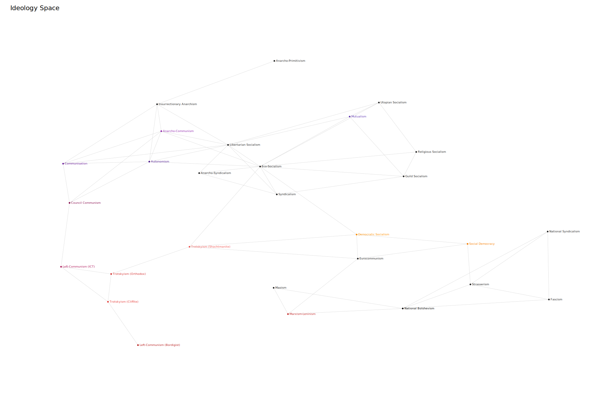
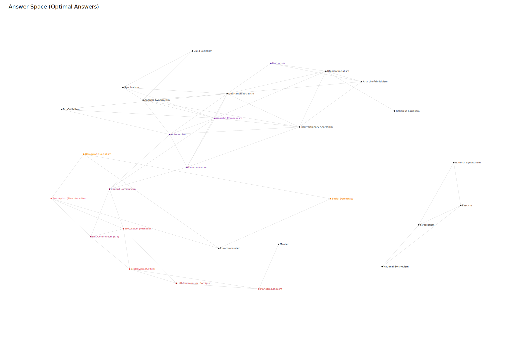

# Triangular LeftValues

## Requirements (for analysis tools)

```bash
pip install -r requirements.txt
```

## Running the Quiz

```bash
python quiz.py
```

The quiz calculates your political profile and finds the closest matching ideologies.

## Analysis Tools

### Nearest Ideologies

```bash
python analysis.py nearest "National Bolshevism"
```

Shows the ideologies closest to a given ideology in ideological space.

### Generate Answer Keys

```bash
python analysis.py optimise "Left-Communism (ICT)"
```

Generates answer sets that most closely produce the target ideology.

### Attainability Analysis

```bash
python analysis.py attainability
```

Determines how closely each ideology can be reached through actual quiz responses.

## Visualisation

### Ideology Space

```bash
python mds.py ideology-space
```

Produces:

```text
ideology_space.svg
```



### Answer Space

```bash
python mds.py answer-space
```

Produces:

```text
answer_space.svg
```



## Methodology

Ideologies are represented as vectors in a high-dimensional space. Euclidean distances between ideologies are used for matching and visualisation. Multidimensional Scaling (MDS) projects those distances into two dimensions to create ideology maps while preserving relative ideological similarity.
